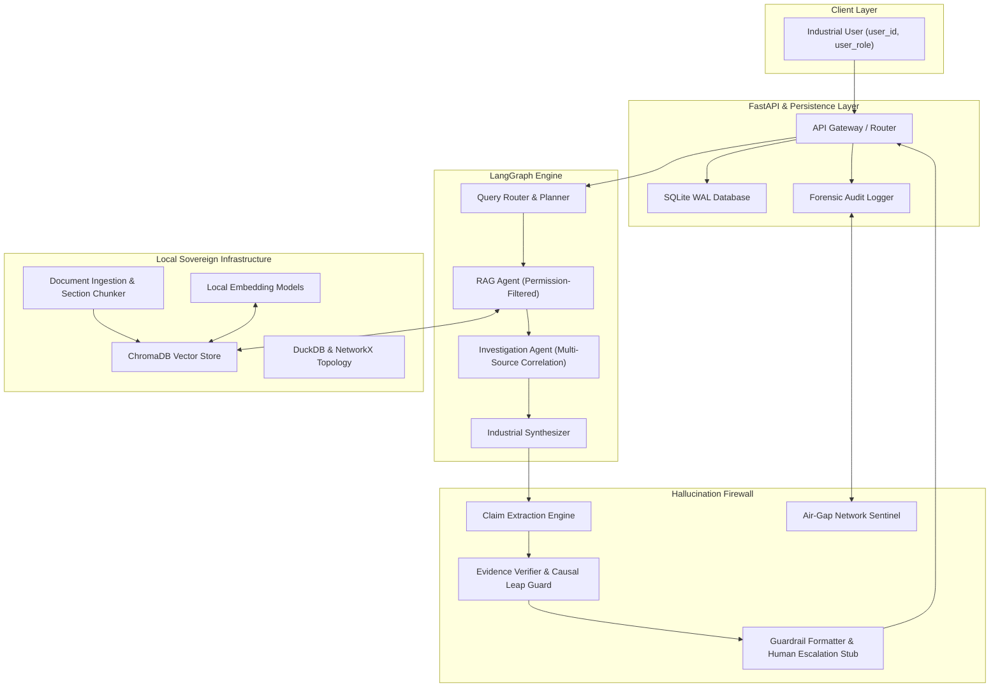

# INDUSAI-X: Sovereign On-Premise Industrial Agentic AI Workbench

**SIH26117 | Mangalore Refinery and Petrochemicals Limited (MRPL)**  
*Theme: Smart Automation | Type: Software*

---

## Executive Summary

**INDUSAI-X** is an air-gappable, sovereign industrial AI platform engineered for confidential refinery and petrochemical operations. Unlike public cloud chatbots, INDUSAI-X operates entirely on local, open-weight foundation models to preserve operational data sovereignty while automating complex root cause investigations, SOP retrieval, and multi-source engineering analysis.

The system delivers:
1. **Sovereign Local Inference**: Zero outbound API calls; local embeddings and LLM inference (SentenceTransformers, Ollama).
2. **Permission-Aware RAG**: Strict role-based access control (RBAC) enforced at vector retrieval time before data reaches model context.
3. **LangGraph Multi-Agent Orchestration**: Specialized agents for planning, document search, multi-source cross-correlation, and evidence synthesis.
4. **Data Intelligence & Knowledge Graph**: Safe in-memory DuckDB SQL engine with AST protection and NetworkX refinery asset topology reasoning.
5. **Industrial Hallucination Firewall**: Deterministic claim verification, cross-source contradiction detection, and automated causal leap downgrading.
6. **Forensic Auditability & Air-Gap Sentinel**: Tamper-evident SHA-256 chained audit logs and real-time process socket inspection with certified air-gap proof.

---

## Architecture Overview



---

## Repository Structure

```
INDUSAI-X/
│
├── .github/
│   ├── workflows/
│   │   ├── ci.yml                 # Ruff linting and MyPy static type checking
│   │   ├── tests.yml              # Pytest suite with code coverage matrix
│   │   └── pr-checks.yml          # Pull request validation
│   └── pull_request_template.md   # Standardized PR checklist
│
├── backend/
│   ├── app/                       # FastAPI Web & Persistence Layer (Spine)
│   │   ├── main.py                # App factory, CORS, startup recovery sweep
│   │   ├── api/routes/            # Workspaces, Files, Queries, Audits, Health
│   │   ├── core/                  # Security context and Pydantic settings
│   │   ├── db/                    # SQLite WAL engine and SQLAlchemy models
│   │   ├── schemas/               # API request/response schemas
│   │   ├── services/              # File, Workspace, Audit, and Agent services
│   │   └── integrations/          # Clients connecting to RAG and Agents
│   │
│   ├── agents/                    # Multi-Agent Intelligence Core
│   │   ├── __init__.py
│   │   ├── planner.py             # Intent classification and workflow planner
│   │   ├── rag_agent.py           # Permission-filtered RAG with self-healing retry
│   │   ├── investigation_agent.py # Multi-source correlation across reports
│   │   └── engineering_agent.py   # Operating limit and sensor parameter checks
│   │
│   ├── graph/                     # LangGraph Workflow Engine
│   │   ├── __init__.py
│   │   ├── state.py               # TypedDict AgentState definition
│   │   ├── workflow.py            # Compiled multi-agent StateGraph
│   │   └── routes.py              # FastAPI graph execution endpoints
│   │
│   ├── rag/                       # Sovereign Local RAG Pipeline
│   │   ├── __init__.py
│   │   ├── ingestion.py           # Section-aware and table-aware document parser
│   │   ├── chunking.py            # Context-preserving chunker with metadata schema
│   │   ├── embeddings.py          # Local SentenceTransformers / Ollama service
│   │   ├── chroma_store.py        # Persistent ChromaDB vector store
│   │   ├── retrieval.py           # Permission filter, reranker, query expander
│   │   └── evidence.py            # Standard Evidence and EvidencePack schemas
│   │
│   └── verification/              # Hallucination Firewall & Verification
│       ├── __init__.py
│       ├── claim_extractor.py     # Atomic factual claim extraction
│       ├── verifier.py            # NLI support scoring & causal leap guard
│       └── guardrails.py          # 5-section response formatter & review router
│
├── tests/                         # Comprehensive Automated Test Suite
│   ├── test_agents/               # Planner and RAG agent tests
│   ├── test_rag/                  # Chunking, embeddings, evidence, retrieval tests
│   ├── test_verification/         # Guardrails and causality tests
│   └── test_workflow.py           # End-to-end LangGraph compilation and execution
│
├── benchmark_embeddings.py        # Local embedding model benchmark suite
├── demo.py                        # End-to-end demonstration script
├── docker-compose.yml             # Containerized local deployment configuration
├── API_CONTRACTS.md               # Frozen JSON integration contracts
├── requirements.txt               # Production dependencies
├── requirements-dev.txt           # Testing and development dependencies
├── pyproject.toml                 # Packaging, Ruff, MyPy, and Pytest configuration
└── README.md                      # Project documentation
```

---

## Core Engineering Features

### 1. Permission-Aware Document Ingestion & Chunking
- **Section- & Table-Aware**: Preserves document structure, headers, and tabular data without tearing rows or context.
- **Exact Metadata Schema**: Every chunk retains strict provenance and access control attributes:
  ```json
  {
    "chunk_id": "chunk_8f29",
    "document_id": "maintenance_report_102",
    "document_name": "Pump_P-101_Maintenance.pdf",
    "page": 14,
    "section": "Root Cause Analysis",
    "equipment_id": "P-101",
    "document_type": "maintenance_report",
    "department": "maintenance",
    "classification": "confidential",
    "allowed_roles": ["maintenance_engineer", "supervisor"],
    "timestamp": "2026-08-20"
  }
  ```

### 2. Self-Healing Retrieval with 1-Hop Re-retrieval
- Solves industrial vocabulary mismatches by mapping colloquial descriptors (e.g. *booster pump* $\leftrightarrow$ `P-101`, *pre-heat exchanger* $\leftrightarrow$ `HEX-301`, *thermal excursion* $\leftrightarrow$ *high temperature*).
- If initial retrieval returns zero results, the system executes an automated 1-hop query expansion retry.
- If no evidence exists in the repository, the workflow gracefully terminates into `INSUFFICIENT_EVIDENCE` without hanging or speculating.

### 3. Hallucination Firewall & Causal Leap Downgrader
- **Claim Support Classification**:
  - `SUPPORTED` (Score $\ge 0.85$): Allowed with verified citations.
  - `PARTIALLY_SUPPORTED` ($0.60 \le \text{Score} < 0.85$): Enforces cautious, hedged language.
  - `CONTRADICTED`: Conflicting evidence flagged for human review.
  - `INSUFFICIENT_EVIDENCE`: Explicitly declared as unverified.
- **Causal Leap Guard**: When co-occurring observations (e.g., *bearing temperature exceeded normal* and *lubrication contamination observed*) are asserted as direct causation without explicit document confirmation, the system automatically downgrades the claim to `PARTIALLY_SUPPORTED` and outputs hedged findings:
  > *"Available records indicate lubrication contamination and abnormal bearing temperature. These factors may be related; however, the documents do not conclusively establish direct causation."*

### 4. Standardized Output Format
Every query produces a structured 5-section response:
```
ANSWER
────────────────────────
Verified Findings
• Finding 1 [Source: Report.pdf, Page 14]
• Finding 2 [Source: Inspection.pdf, Page 3]

Analysis
• Based on the available evidence...

Uncertainty
• The records do not establish...

Confidence: HIGH / MEDIUM / LOW

Evidence
[1] Report.pdf — Page 14
[2] Inspection.pdf — Page 3
```

---

## Offline Inference & Embedding Benchmarks

All metrics represent inference and retrieval executed **100% locally and offline** without internet connectivity.

### 1. Local LLM Inference Benchmarks (Ollama Offline Runtime)

| Model | Parameter Size | Task / Prompt Complexity | Time to First Token (TTFT) | Throughput (tok/s) | Total Latency | Key Recommendation |
|---|:---:|---|:---:|:---:|:---:|---|
| **Llama 3.2 3B** | 3.2B | Short Query (Capital of India) | **0.51 s** | **10.2 tok/s** | **1.44 s** | **Primary Agent Default**: Lowest TTFT & highest throughput |
| **Llama 3.2 3B** | 3.2B | Medium Prompt (DPDP Summary) | **0.75 s** | **10.1 tok/s** | **2.66 s** | Ideal for interactive query routing & agent planning |
| **Llama 3.2 3B** | 3.2B | Long Policy Analysis | **1.50 s** | 8.1 tok/s | 65.23 s | Fast initial response for long context synthesis |
| **Phi-3 Mini** | 3.8B | Short Query (Capital of India) | 0.52 s | 8.1 tok/s | 34.00 s | High precision for structured formula extraction |
| **Phi-3 Mini** | 3.8B | Medium Prompt (DPDP Summary) | 1.37 s | 7.5 tok/s | 19.73 s | Solid reasoning on technical engineering procedures |
| **Phi-3 Mini** | 3.8B | Long Policy Analysis | 2.77 s | 6.2 tok/s | 86.40 s | Best suited for asynchronous batch analysis |
| **Qwen 2.5 3B** | 3.0B | Short Query (Capital of India) | 2.00 s | 7.0 tok/s | 19.26 s | Strong multilingual and code understanding |
| **Qwen 2.5 3B** | 3.0B | Medium Prompt (DPDP Summary) | 2.20 s | 8.3 tok/s | 40.55 s | High instruction following on strict JSON schemas |
| **Qwen 2.5 3B** | 3.0B | Long Policy Analysis | 1.90 s | **8.7 tok/s** | 60.98 s | High sustained throughput during long context generation |

### 2. Local Embedding Model Benchmarks (MRPL Technical Eval Set)

| Candidate Model | Vector Dimension | Query Latency | Throughput | Recall@1 | Recall@3 | Memory Overhead |
|---|:---:|:---:|:---:|:---:|:---:|:---:|
| `all-MiniLM-L6-v2` (Local PyTorch) | 384 | < 1 ms | ~906 chunks/s | 100% | 100% | 0.12 MB |
| `bge-small-en-v1.5` (Local PyTorch) | 384 | < 1 ms | ~1,219 chunks/s | 100% | 100% | 0.12 MB |
| `nomic-embed-text` (Ollama Daemon) | 768 | Local HTTP | ~1-2 chunks/s | 100% | 100% | 1.54 MB |

To reproduce the benchmark:
```bash
python benchmark_embeddings.py
```

---

## Installation & Setup

### Prerequisites
- Python 3.10, 3.11, or 3.14
- Git

### Quickstart

```bash
# 1. Clone the repository
git clone https://github.com/M0izz/Clora.git
cd Clora

# 2. Create and activate a virtual environment
python -m venv .venv
source .venv/bin/activate  # On Windows: .venv\Scripts\activate

# 3. Install dependencies
pip install -r requirements-dev.txt

# 4. Run automated test suite
pytest tests/ -v

# 5. Start the FastAPI local server
python -m uvicorn backend.app.main:app --host 127.0.0.1 --port 8000 --reload
```

Interactive API documentation:
- Swagger UI: `http://127.0.0.1:8000/docs`
- Redoc: `http://127.0.0.1:8000/redoc`

---

## Running the Demonstration

To execute the full end-to-end industrial investigation workflow (including permission filtering, multi-agent reasoning, causal downgrading, and structured audit logs):

```bash
python demo.py
```

---

## Continuous Integration & Quality Standards

Every Pull Request is validated through automated GitHub Actions workflows:

| Workflow | Configuration | Checks Performed |
|---|---|---|
| **CI** | `.github/workflows/ci.yml` | Ruff linting and MyPy type safety |
| **Automated Tests** | `.github/workflows/tests.yml` | Pytest execution with coverage reporting across Python matrix |
| **PR Validation** | `.github/workflows/pr-checks.yml` | Pull request template compliance and metadata checks |

---

## License

This project is licensed under the MIT License — see the [LICENSE](LICENSE) file for details.
